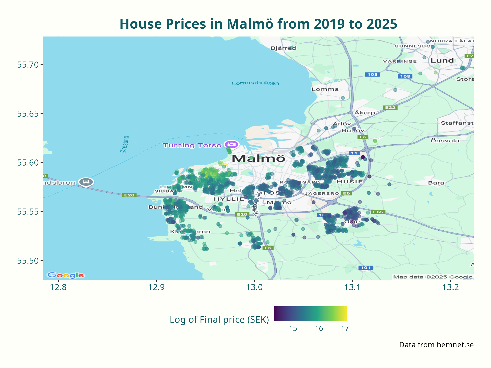
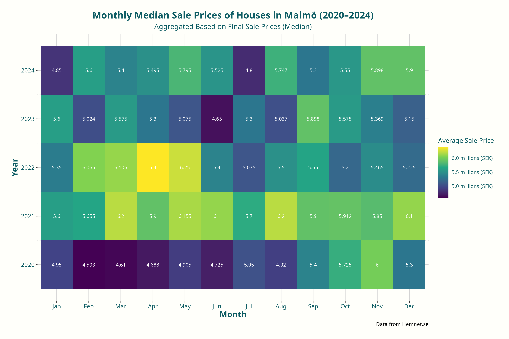
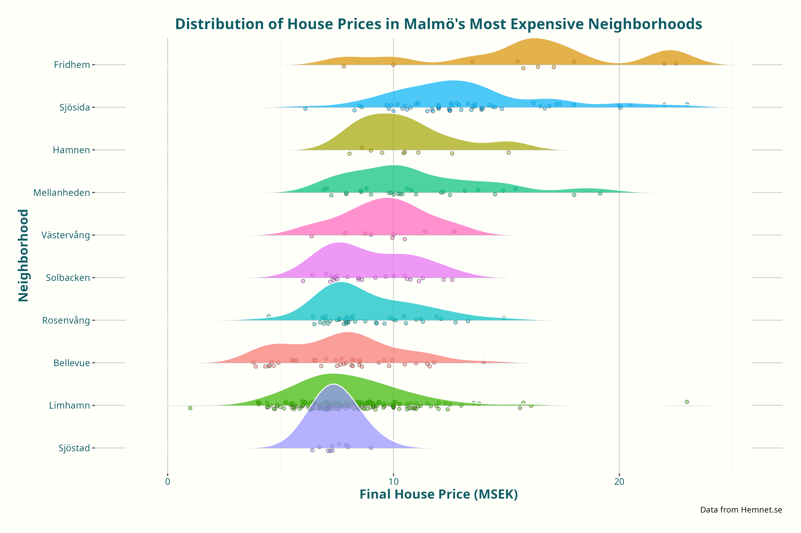

# Malmö Villa Market Analysis 2019–2025
Web scraping and regression analysis in R using villa sales data from Hemnet

## Executive Summary
This project investigates how sold villas (from Hemnet) within Malmö Municipality vary. The statistical model takes into account both the characteristics of the house (such as living area, operating costs, number of rooms, etc.) and the neighborhood in which the house is located (e.g., Limhamn, Fosie, Rosengård).

The most significant factors affecting the price are the size of the living area and number of rooms. Larger plots and a newer construction year also contribute to a higher price. If information about the secondary area is missing, the price decreases slightly. Operating costs and the sale date, however, have a very small impact. Furthermore, the analysis indicates that house prices have increased consistently each year. The variable "sale year" (ranging from 2019 to 2025) shows an average annual price increase of +1.37%.

An important aspect of the model is that it adjusts the price depending on the neighborhood the house is located in. For example, houses in Limhamn are 43% more expensive, while houses in Rosengård are 18% cheaper than the average — even if the houses are identical on paper.

In summary: both the size of the house and its location are crucial factors in determining the price. Where you live can influence the price as much as the house's characteristics. The model's fixed effects explain 23% of the variation in house prices, and when neighborhood differences (random effects) are also accounted for, around 80% of the variation is explained.

## Data Visualization Examples

### Geo-data Plot

Here’s an example of the geographic distribution of villa prices in Malmö:



### Heatmap

This heatmap shows the monthly median sale prices of villas in Malmö (2020-2024)



### Ridgline Plot

This ridgeline plot shows the distribution of house prices in the ten most expensive neighborhoods in Malmö.



## Exploratory Data Analysis (EDA) Report
You can view the full explanatory analysis and statistical report by clicking the link below:

[View the full explanatory analysis report](https://github.com/Bengtegard/malmo-villa-market-2019-25/releases/download/v1.0/explanatory_analysis.html)


## Project Structure
```
malmo-housing-project/
│── data/                           # Data folders 
│   │── raw/                        # Raw data directly from Hemnet
│   │── interim/                    # Data for regression and splitting
│   │── processed/                  # Cleaned and processed data
│   │── external/                   # External data from SCB API (pxweb)
│── docs/                           # Documentation files (e.g., Rmarkdown-generated HTML report)
│── models/                         # Files related to regression models used in the analysis
│── notebooks/                       # Rmarkdown notebooks
│── reports/figures/                 # Generated figures and plots for the report
│── src/                             # Source code
│   │── data/                       # Scripts for web scraping, cleaning, and processing data
│   │── models/                     # Scripts for training, evaluating, and saving models
│   │── visualization/              # Scripts for visualizing data and model results
│── environment.yml                 # Conda environment file
│── README.md                       # Project documentation
```

## Setup

Follow these steps to set up and run the project:
   ```bash
   # Clone the repo
   git clone https://github.com/bengtegard/malmo-villa-market-2019-25.git
   cd malmo-villa-market-2019-25

   # Create and Activate the Conda Environment
   conda env create -f environment.yml
   conda activate malmo-housing-env_r

   # Run the Rmarkdown file
   rmarkdown::render("exploratory_analysis.Rmd")

